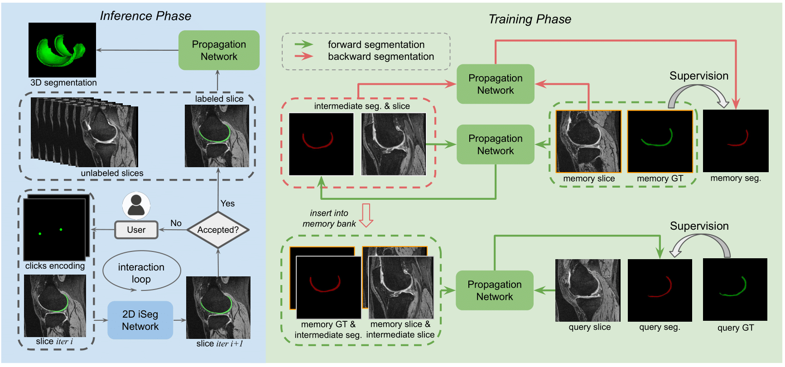

# [Exploring Cycle Consistency Learning in Interactive Volume Segmentation](https://arxiv.org/abs/2303.06493)

    
    

  

## Installation
The code requires ``python>=3.8``, ``pytorch>=1.12``, and ``torchvision>=0.13``. Installing both PyTorch and TorchVision with CUDA support is highly recommended.

## Getting Started
