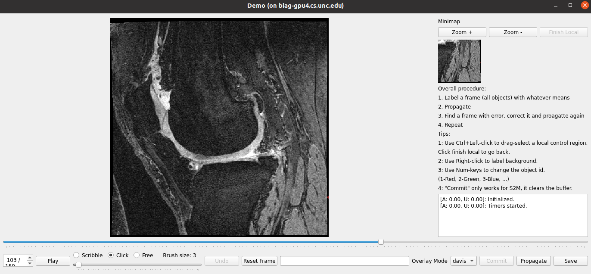

# Exploring Cycle Consistency Learning in Interactive Volume Segmentation
PyTorch implementation for paper 
[Exploring Cycle Consistency Learning in Interactive Volume Segmentation](https://arxiv.org/abs/2303.06493). <br>
Qin Liu<sup>1</sup>,
Meng Zheng<sup>2</sup>,
Benjamin Planche<sup>2</sup>,
Zhongpai Gao<sup>2</sup>,
Terrence Chen<sup>2</sup>,
Marc Niethammer<sup>1</sup>, 
Ziyan Wu<sup>2</sup> <br>
<sup>1</sup>UNC-Chapel Hill, <sup>2</sup>United Imaging Intelligence</sup> <br>
#### [Paper](https://arxiv.org/abs/2303.06493) | [Demo Videos](https://drive.google.com/drive/folders/1bPLn7ZsZB3xRKNhxOB0ewWX3rlxp2pK_?usp=sharing)

<p align="center">
  
</p>

This repository also contains the following work (branch [v1.0](https://github.com/uncbiag/iSegFormer/tree/v2.0)): 
> [iSegFormer: Interactive Image Segmentation via Transformers with Application to 3D Knee MR Images](https://arxiv.org/abs/2112.11325). (MICCAI 2022) <br>
> Qin Liu,
> Zhenlin Xu,
> Yining Jiao,
> Marc Niethammer <br>
> UNC-Chapel Hill <br>

## Installation
The code is tested with ``python=3.9``, ``torch=1.12.0``, and ``torchvision=0.13.0`` on an A6000 GPU.
```
git clone https://github.com/uncbiag/iSegFormer
cd iSegFormer
```
Note that our implementation for this work is on the branch v2.0. It's not the default branch when you clone this repository locally, so you always need to checkout v2.0 manually.
```
git checkout v2.0
```
Now, create a new conda environment and install required packages accordingly.
```
conda create -n isegformer python=3.9
conda activate isegformer
pip3 install -r requirements.txt
```

## Getting Started
First, download AbdomenCT-1K dataset and model weights. AbdomenCT-1K will be saved in the ``data`` folder; model weight will be saved in the ``saves`` folder.
```
python download.py
```
Unzip the AbdomenCT-1K in the ``data`` folder accordingly. Then run a demo:
```
./run_demo.sh
```
You will get a GUI as below: 
<p align="center">
  
</p>

## Training
To finetune an STCN model on AbdomenCT-1K with cycle consistency loss:
```
./run_train_stcn_with_cycle.sh
```
To finetune an STCN model on AbdomenCT-1K without cycle consistency loss:
```
./run_train_stch_without_cycle.sh
```

## Evaluation
To evaluate a trained model on AbdomenCT-1K:
```
./eval_stcn.sh
```

## Acknowledgement

We sincerely thank [STM](https://github.com/seoungwugoh/STM), [STCN](https://github.com/hkchengrex/STCN), [MiVOS](https://github.com/hkchengrex/MiVOS), [AbdomenCT-1K](https://github.com/JunMa11/AbdomenCT-1K) for providing their wonderful code to the community!


## Citation
```bibtex
@article{liu2023exploring,
  title={Exploring Cycle Consistency Learning in Interactive Volume Segmentation},
  author={Liu, Qin and Zheng, Meng and Planche, Benjamin and Gao, Zhongpai and Chen, Terrence and Niethammer, Marc and Wu, Ziyan},
  journal={arXiv preprint arXiv:2303.06493},
  year={2023}
}
```
